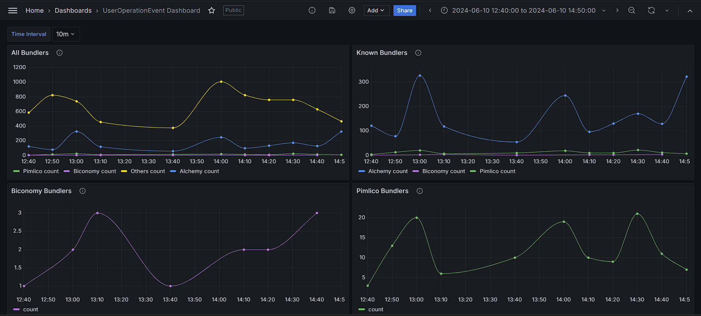
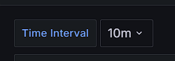

# Event Dashboard

A live dashboard to monitor `UserOpertationEvent` from the `EntryPoint` [Contract](https://polygonscan.com/address/0x5ff137d4b0fdcd49dca30c7cf57e578a026d2789) on Polygon.

## Installation

Use the following steps to setup the event processing pipeline:

```
npm i
export CONNECTION_STRING=<DB connection string>
npm run start
```

Make sure you have access to the DB connection string to set the environment variable.

## Event processing pipeline

The pipeline monitors live `UserOperationEvents` from the `EntryPoint` contract, and adds each event to a off-chain database for storage.

The pipeline has a list of bundler addresses and their Entities. Some of them being:

- Biconomy
- Alchemy
- Pimlico

and more. The pipeline checks each event for the bundler when adding it to the database.

## Grafana Dashboard

Once the pipeline is running, it will push all events to the database in real time. This can be monitored live on the Grafana Event Dashboard [here](https://eventdash.grafana.net/goto/Lk5loZ8Ig?orgId=1).

Public Dashboard link: [here](https://eventdash.grafana.net/public-dashboards/c519162ac4f647448a2e305824ead0a7)

The dashboard can display event counts per interval, such as 10m, 1h, 1d or 1w. It also categorizes all events by their respective bundlers. Providing an insightful view of the event data.



The dashboard has a **Time Interval** variable that can be used to change the time interval for the data displayed on the dashboard.



**Please note** as Grafana does not support sharing template variables on public dashboards yet, this might not be available on the public dashboard link. Please use the original dashboard link [here](ttps://eventdash.grafana.net/goto/Lk5loZ8Ig?orgId=1)
